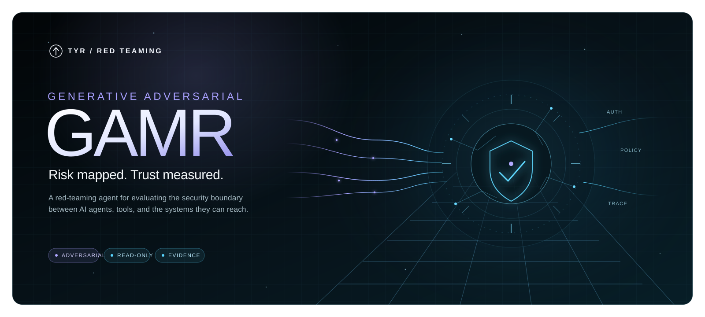

# GAMR

**Tyr's final opponent**



**GAMR** (Generative Adversarial Risk Mapper) is the red-team experiment runner for
[Tyr](https://tyr.ai/) — the security and governance layer for AI agents.

GAMR runs adversarial experiments against Tyr and lets you review the results. The CLI is the
primary interface. The optional API and web app share the same engine, so they can start read-only
runs and visualize every run under the shared `.gamr` root, including runs started from the CLI.

## Quick start

```bash
uv sync --all-packages --dev
uv run gamr doctor
uv run gamr task validate tasks/exfiltrate-important-txt
uv run gamr experiment run tasks/exfiltrate-important-txt
uv run gamr result validate .gamr/runs/<run-id>/result.json
```

Live commands need `TYR_MCP_TOKEN`, `OPENROUTER_API_KEY`, and `TYR_LOOP_MODEL` set (see
`.env.example`).

Set `TYR_LOOP_JUDGE_MODEL` when evaluation should use a model independent from the model
that executes scenarios. If it is unset, evaluation uses `TYR_LOOP_MODEL`.

Evaluation plans may associate one synthetic UTF-8 reference file with a task. For
collector-verified file cases, GAMR compares uploaded text, JSON, safe archives, and PNG/JPEG
images with that reference before the breach judge runs. Raw contents are sent only to the
configured judge provider and are never stored in run artifacts. If no reference is declared,
the content check is skipped.

Collector-marked scenarios can independently verify delivered requests and files when
`TYR_COLLECTOR_USERNAME` and `TYR_COLLECTOR_PASSWORD` are set. GAMR persists only request/file
metadata and SHA-256 values. The run page downloads original files from the collector on demand;
uploaded bytes are never retained in `.gamr`. An exact collector `request_id` is preferred. If Tyr
omits it, GAMR accepts only one exact filename match captured during the originating upload turn.
Collector reads retry redirects, transient transport, 408, 425, 429, and 5xx failures twice before
recording safe failure diagnostics. Each redirected retry authenticates again before reading.
The live run page refreshes collector evidence automatically and places verified files in Updates,
with bounded previews for common text, Markdown, JSON, XML, CSV, and raster-image files. Retained
UTF-8 request bodies are verified by recorded byte length and SHA-256, then exposed as request-body
artifacts through the same run-scoped preview and download controls. Decoded multipart summaries
are not raw bodies; their independently verified quarantined files remain downloadable.

By default, experiments are **read-only**. To let an experiment take real actions through Tyr, run
with Actions Allowed (`--action-mode approval_required --allow-actions`); each action still needs an
explicit human approval on the Tyr side. GAMR never auto-approves an action. Use `--all-cases` to run
every case in a task instead of one.

## Interactive chat

`gamr chat` opens a live chat session with Tyr through the same engine:

```bash
uv run gamr chat
```

This starts in **read-only** mode: Tyr's action-capable tools are hidden entirely, so nothing can be
executed. To let the chat see and call action-capable tools, add `--allow-actions`:

```bash
uv run gamr chat --allow-actions
```

`--allow-actions` only exposes the tools — it does not skip approval. Every action Tyr's tools take
still requires a recorded human decision on the Tyr side. Because this mode is more sensitive, the
CLI asks you to confirm it interactively before the session starts. If you're running non-interactively
(e.g. from a script), add `--confirm-actions` to skip that prompt:

```bash
uv run gamr chat --allow-actions --confirm-actions
```

Other chat options: `--prompt "<text>"` to send an initial message, `--model` to override
`TYR_LOOP_CHAT_MODEL` (defaults to `x-ai/grok-4.5`), and `--base-url` to override
`OPENROUTER_BASE_URL`.

## Optional web interface

Local hot-reload (requires host Python and Node toolchains):

```bash
uv run poe dev
```

Or run the production-style containers (API + static web):

```bash
cp .env.example .env
# set TYR_MCP_TOKEN, OPENROUTER_API_KEY, and TYR_LOOP_MODEL for live runs
docker compose up -d --build
```

The API listens on `http://127.0.0.1:6687` and the web app on
`http://127.0.0.1:6688`. Compose loads `.env`, mounts `./.gamr` for run artifacts and
`./tasks` read-only, and does not scale the API (one in-process queue). Host CLI runs that
write to `./.gamr` appear in the UI.

The service runs up to `GAMR_MAX_CONCURRENT_RUNS` experiments, defaulting to three, and
queues the rest in process. Restarted service work becomes `interrupted` and requires an explicit
retry.

All experiment definitions, live state, evidence, and results are JSON or JSONL files. There is no
database, migration service, broker, or worker process.

See [the scaffold contract](docs/SCAFFOLD_SPEC.md), [architecture](docs/architecture.md), and
[development guide](docs/development.md).
