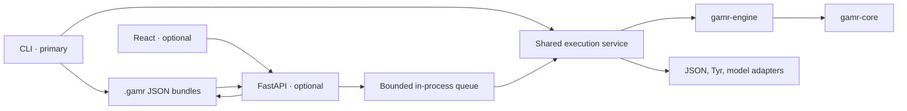

# Architecture

The CLI is GAMR's primary entry point. The web app and API are optional interfaces for starting
starting experiments and visualizing shared run bundles.

`gamr-core` owns validated contracts. `gamr-engine` owns workflow and shared finalization.
`gamr-adapters` owns provider and filesystem I/O. Apps compose these packages without duplicating
experiment logic or invoking CLI subprocesses.

One API process owns service scheduling. The default concurrency is three; additional runs wait
FIFO. JSON is authoritative, while activity search and relationship views are derived in memory.
The filesystem and scheduler boundaries stay narrow so a demonstrated future deployment need can
replace either without changing the engine.
