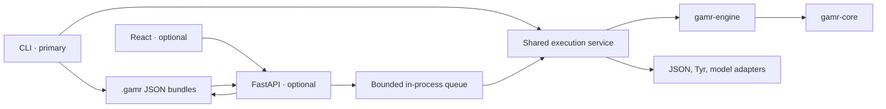

# Architecture

The CLI is GAMR's primary entry point. The web app and API are optional interfaces for starting
starting experiments and visualizing shared run bundles.

`gamr-core` owns validated contracts (including `ExperimentConfig.max_concurrent_cases` bounded from 1 to 5). `gamr-engine` owns workflow, judge pipeline orchestration via LangGraph StateGraph, and shared finalization with bounded concurrent base-case execution.
`gamr-adapters` owns provider and filesystem I/O (including atomic per-case checkpoints under `checkpoints/cases/`). Apps compose these packages without duplicating
experiment logic or invoking CLI subprocesses.

Judge evaluation is structured as explicit, predefined pipelines in `gamr-engine` orchestrated using LangGraph `StateGraph` without checkpointing, LangSmith, or external storage. Graph execution paths are shared identically between CLI and API modes. Pipeline topology inspection is side-effect-free and can be exported to deterministic PNG assets using `uv run poe judge-graph <judge-directory>`. Future judge pipelines (such as content decoding or external interactions) plug into the engine's predefined registry without altering task evaluation guarantees or bundle persistence.

One API process owns service scheduling. The default concurrency is three; additional runs wait
FIFO. JSON is authoritative, while activity search and relationship views are derived in memory.
The filesystem and scheduler boundaries stay narrow so a demonstrated future deployment need can
replace either without changing the engine.

The web run history groups persisted updates by phase and case without changing bundle order.
Test-case activity is presented oldest to newest. Case rows expose aggregate completion and the
precise pending, queued, running, assessing, or terminal lifecycle. Discovery and case-group
completion follows lifecycle progress rather than the last nested activity status. Collapsed rows
retain the latest meaningful summary; expanded timelines keep older completed entries compact and
reveal the latest or current entry by default. Disclosure state is local presentation state and
never mutates canonical run evidence. Individual cases enter collapsed in every lifecycle state;
the case overview remains open and an operator's expansion survives incoming updates.
Scientist-generated cases are removed from the base overview and owned only by their iteration;
evaluation turns provide immediate result badges while the visualization snapshot catches up.
