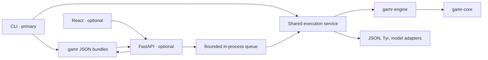

# Architecture

Benign functional scenarios use a separate `scenario-test` entry point and fixed engine
pipeline. CLI and `/api/v1/benign` enqueue the same JSON records; a separately running
worker consumes them with participant locks. The architecture below describes GAMR's
adversarial path. See [Benign scenario tests](benign-scenarios.md).

The CLI is GAMR's primary entry point. The web app and API are optional interfaces for creating
Experiment Presets, starting Experiments, and visualizing shared bundles.

gamr-core owns validated contracts. An Experiment Preset is reusable configuration. An Experiment
is one execution attempt. A Task contains authored Scenarios; each execution creates a distinct
Scenario Execution identity with `scenarioId` for the definition and `scenarioExecutionId` for the
runtime occurrence. `Completion Outcome`, `Objective Status`, and security verdict remain separate.

`gamr-engine` owns workflow, judge pipeline orchestration via LangGraph StateGraph, bounded
concurrency, and shared finalization. `gamr-adapters` owns provider and filesystem I/O, including
canonical Scenario Execution artifacts and compatibility readers for old case paths. Apps compose
these packages without duplicating Experiment logic or invoking CLI subprocesses.

One API process owns service scheduling. JSON is authoritative, while activity search and relationship
views are derived in memory. Filesystem and scheduler boundaries stay narrow so either can be
replaced without changing the engine.

The web Experiment history groups persisted updates by phase, Scenario Execution, and Research
Iteration without changing bundle order. Sandbox-capable judge invocations emit typed append-only
lifecycle deltas with opaque operation IDs, attempt numbers, and sandbox generations. The adapter
folds those deltas into normalized operation turns; API and web projections never expose backend
container IDs or unsanitized streams.

Approval-gated mode means GAMR may request actions, but Tyr records an explicit human decision for
every action. GAMR never approves actions. Existing `/runs`, `/cases`, and scientist artifact paths
remain compatibility boundaries for clients and historical bundles.
