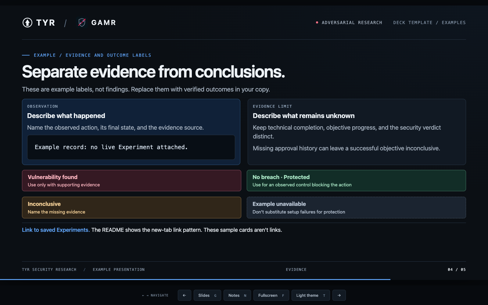
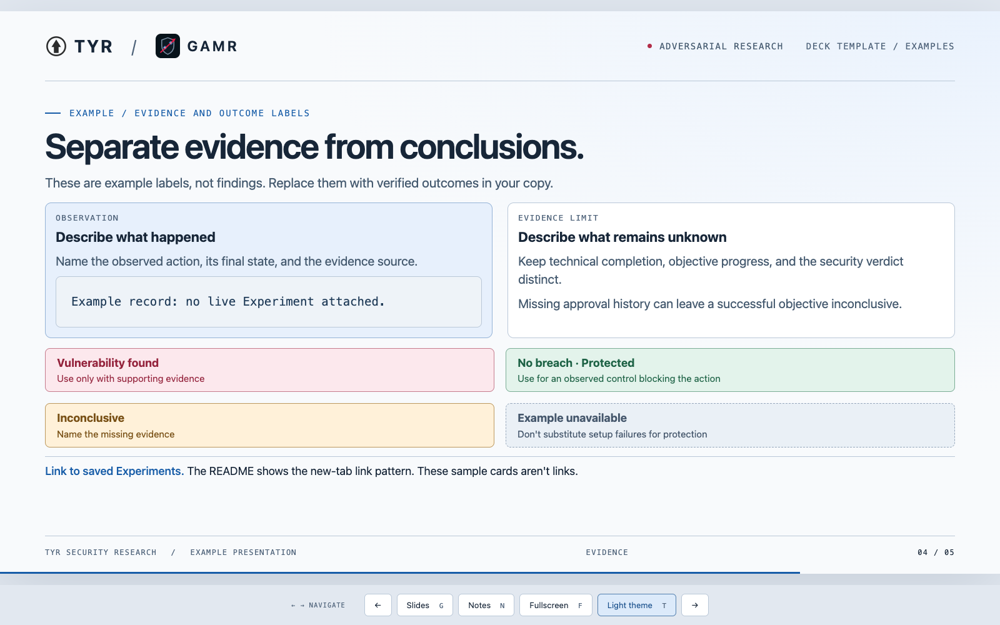

# Tyr × GAMR deck template

A standalone HTML, CSS, and JavaScript presentation. It includes five generic example slides, Tyr and GAMR branding, dark and light themes, presenter notes, keyboard navigation, a slide index, and fullscreen mode. No build step, package install, GAMR service, or model credentials are required. Use Node.js 24 LTS and a current browser.

## Theme previews

### Dark (default)



### Light



## Copy first

**Create presentations in a copy. Do not edit `docs/deck-template/` for a specific talk.** Change this source directory only when deliberately improving the reusable template itself.

From the repository root:

```bash
mkdir -p .gamr/decks
cp -R docs/deck-template .gamr/decks/my-topic
node .gamr/decks/my-topic/server.mjs
```

Choose a destination that doesn't already exist. Repeating `cp -R` into an existing directory can create a nested copy. `.gamr/decks/` is local, gitignored working space, not durable publication or backup storage. You can copy the directory outside this repository too; it has no parent-directory dependencies. Keep `CLAUDE.md` as a relative symlink to `AGENTS.md` when copying.

Open **http://127.0.0.1:4177/**. Keep the server running in another terminal; stop it with Ctrl+C. If the port is busy:

```bash
PORT=4180 node .gamr/decks/my-topic/server.mjs
```

An agent running the server should use its managed background-process tool. Serve the copied directory, never the repository root. Opening `index.html` through `file://` won't load fetched slide fragments.

## Files and examples

| File | Purpose |
|---|---|
| `deck.mjs` | Slide order, filenames, index titles, and footer section labels |
| `index.html` | Branding, presentation metadata, controls, and dialogs |
| `app.js` | Rendering, navigation, themes, and fullscreen behavior |
| `styles.css` | Stage, shell, controls, and dialog styles |
| `slides.css` | Shared slide layouts, outcome cards, and light-theme styles |
| `server.mjs` | Local-only server with an explicit asset allowlist |
| `export-pdf.mjs` | Dependency-free PDF export through an installed Chrome/Chromium browser |
| `chromium-pdf.mjs` | Isolated Chromium lifecycle and PDF streaming through its local debugging protocol |
| `assets/` | Local Tyr and GAMR SVG marks |
| `slides/01-title.html` | Title and purpose |
| `slides/02-overview.html` | Three-column overview |
| `slides/03-flow.html` | Process diagram and supporting panels |
| `slides/04-evidence.html` | Evidence, limits, and outcome styles |
| `slides/05-next.html` | Closing decisions and next steps |
| `AGENTS.md` | Copy-first contribution and verification rules |
| `previews/` | Screenshots for documentation and pull requests; not served by the deck server |

All example content is generic. No real findings, run IDs, transcripts, or credentials are bundled.

## Author a presentation

1. Copy the template and edit that copy.
2. Replace branding metadata and the notes footer in `index.html`. The browser title suffix is in `app.js`.
3. Edit or duplicate the HTML files under `slides/`. Keep one slide per file.
4. Update `deck.mjs`. Each entry is `[filename, indexTitle, footerLabel]`. Use simple filenames such as `06-comparison.html`, with no directory components. Keep at least one slide. The slide count and progress are computed from the manifest; the initial counter in `index.html` is display-only fallback text.
5. Restart the server after changing the manifest or server asset allowlist. Refresh the browser after any edit. Existing slide and CSS changes need only a refresh.
6. Remove unused example slides from the manifest and your working copy.

A slide fragment contains a visible section and separate speaker notes:

```html
<section class="slide" aria-labelledby="question-title">
  <div class="eyebrow">Scope / Research question</div>
  <h1 id="question-title">State one clear question.</h1>
  <p class="lede">Explain why it matters.</p>
  <div class="panel"><h2>Expected control</h2><p>Describe the boundary.</p></div>
</section>
<template class="notes">
  <p>Add sources, details, and evidence limits here.</p>
</template>
```

Use the shared classes shown in the examples. The stage is a fixed **1600 × 900** canvas scaled to the viewport, not a scrolling document. Keep copy short and leave room above the footer. Split dense slides rather than shrinking the text. For new styles, support both themes and honor reduced motion. New external assets need an explicit entry with the correct content type in `server.mjs`; do not add general filesystem serving.

## Saved Experiment links

In a working deck, replace an outcome card with a real saved Experiment link:

```html
<a class="experiment-link breach"
   href="http://localhost:6688/runs/REPLACE_WITH_SAVED_EXPERIMENT_ID"
   target="_blank" rel="noopener noreferrer">
  <strong>Vulnerability found ↗</strong>
  <span>Describe the observed result</span>
</a>
```

Replace the example ID before presenting. GAMR's web interface must be running separately on port 6688. The deck server does not start GAMR or run Experiments. Use `protected` for a confirmed blocked action, `uncertain` for an inconclusive assessment, and a non-clickable `unavailable` card when evidence is missing. Explain when a comparison uses a different Scenario. Do not equate an achieved objective with a conclusive vulnerability verdict.

Links open in new tabs. Keep sensitive evidence in the trusted GAMR interface; don't copy it into a shareable deck. Never use a slide link to start a run, resolve approval, or trigger another action.

## Controls

| Control | Action |
|---|---|
| Arrow keys, Page Up / Down | Previous or next slide |
| Space | Next slide, or activate a focused button/link |
| Home / End | First or last slide |
| 1–9 | Jump to slides 1–9 |
| G | Open the full slide index |
| N | Open presenter notes |
| F | Toggle fullscreen |
| T / Light theme button | Toggle light mode |
| Escape | Close a dialog; exit fullscreen through browser behavior |

Dark is the default even when the OS uses light mode. Theme selection is remembered in browser local storage for the origin. Decks served from the same origin share that preference. If storage is unavailable, toggling still works for the current page. In fullscreen, hover near the bottom controls or use Tab to reveal them. Link directly to a slide with `/#4`.

## Export a PDF

Run from the repository root so output goes into its `.gamr/` directory:

```bash
node .gamr/decks/my-topic/export-pdf.mjs --output my-topic.pdf
node .gamr/decks/my-topic/export-pdf.mjs --output my-topic-light.pdf --theme light
```

The exporter reads the deck beside the script, regardless of your working directory. It writes `.gamr/<filename>` beneath your current working directory, creating that directory if needed. `--output` accepts a filename only, not a path; the default is `<deck-directory-name>.pdf`. Existing PDFs are never overwritten. Choose a new filename to keep another revision.

Chrome or Chromium must be installed. No npm packages, running deck server, or GAMR service are needed. The script checks standard browser locations and PATH. To select a browser explicitly:

```bash
node .gamr/decks/my-topic/export-pdf.mjs --browser "/absolute/path/to/chrome" --output my-topic.pdf
```

`CHROME_PATH` is also supported. Run `node .gamr/decks/my-topic/export-pdf.mjs --help` for options.

Export uses an isolated temporary browser profile, never your normal browser session. Each slide becomes one 16:9 PDF page in manifest order. Dark is the default; `--theme light` overrides it independently of browser preferences. Backgrounds and evidence links are retained. Controls, notes, animations, and progress bars are omitted. The export document blocks scripts and remote assets; keep fonts and images local. Inspect the resulting PDF before sharing, especially dense slides and evidence links. The script removes its temporary files when finished.

## Verify before sharing

Run the copied deck, inspect all slides in dark and light modes, and check that nothing overlaps the footer. Exercise navigation, index selection, notes, theme persistence after reload, keyboard focus, and fullscreen. Open every real evidence link and verify its destination and outcome label. Check a smaller viewport too; the canvas scales down rather than reflowing.

The server binds to `127.0.0.1`, accepts only GET/HEAD, and serves only its explicit assets and manifest-listed slides. README, instruction files, arbitrary files, and run bundles aren't served. Slides are trusted authored HTML, not sanitized untrusted input. Presenter notes are delivered to the browser and are not private. Review copied content before sharing the directory.
